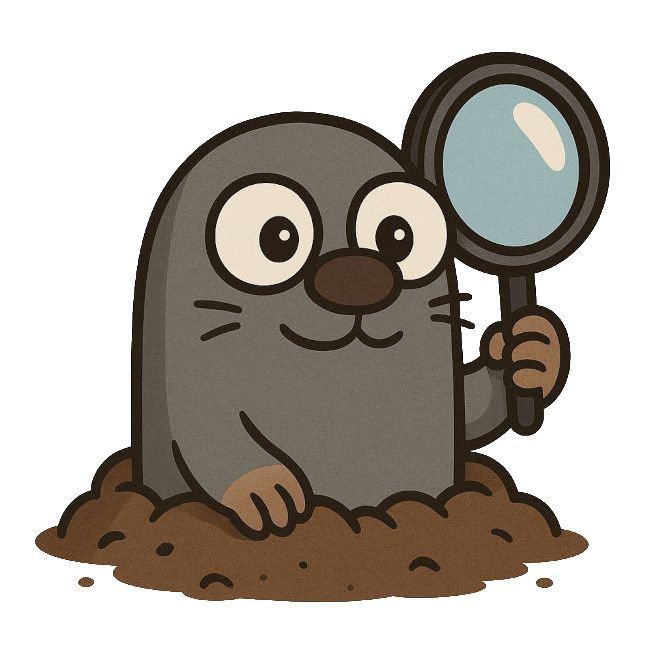

<p align="center">

</p>
<h2 align="center">Digler - Go Deep. Get Back Your Data</h2>

<p align="center">
  ⚠️ <strong>Note:</strong> Digler is in early development (v0.0.1). Some bugs may exist. Please report issues!
</p>

<p align="center">
  <a href="https://github.com/ostafen/digler/actions/workflows/build.yml">
    
  </a>
</p>

## Why Digler?

While many data recovery tools exist, few offer a combination of simplicity, flexibility, and modern design focused on deep disk analysis and effective file carving.

Digler was created to fill this gap by providing a streamlined, reliable command-line tool that makes data recovery easier and more efficient—without the complexity of heavyweight GUIs or fragmented workflows.

Built in Go, Digler leverages the language’s strengths in performance, cross-platform support, and maintainability to deliver a fast and dependable solution for today’s data recovery challenges.


## Features

* **Broad Disk Image and Raw Device Support**: Analyze a wide array of disk image formats (`.dd`, `.img`, etc...) or directly access physical disks.

* **File System Agnostic Analysis**: Recover deleted files regardless of the underlying file system (e.g., NTFS, FAT32, ext4), even when metadata is lost.

* **Reporting Capabilities**: Generate detailed reports, compliant with the `Digital Forensics XML (DFXML)` format, of recovered data and analysis findings.

* **Post-Scan Data Recovery**: Utilize the generated DFXML reports to precisely recover deleted or fragmented files.

* **Intuitive Command-Line Interface**:  A user-friendly CLI designed for efficiency and ease of use.

---

## Installation

**From Source:**

```bash
git clone https://github.com/ostafen/digler.git
cd digler
make build
```

**From Precompiled Binaries:**

Precompiled binaries will be available for Linux, macOS, and Windows on the Releases page.

## Usage

Digler follows a simple but powerful workflow: **scan first, recover later**. This approach lets you analyze disks or images thoroughly before extracting any files.

### 1. Scan a Disk Image or Device
```bash
foo@bar$ digler scan <image_or_device>
```

Example:

###
```bash
foo@bar$ digler scan dfrws-2006-challenge.raw
```

or, to scan an entire disk partition:

###
```bash
foo@bar$ digler scan /dev/nvme0n1 # or C: on Windows
```
By default, the command generates a detailed DFXML report describing the findings, together with a detailed execution log. However, you can optionally specify a dump directory to to recover files immediately during scanning.

```bash
foo@bar$ --dump <path/to/dump/dir>
```

### 2. Mount Scan Results as a Filesystem (Linux only)
```bash
foo@bar$ digler mount <image_or_device> <report_file.xml> --mountpoint /path/to/mnt
```

Example:

```bash
digler mount dfrws-2006-challenge.raw report.xml --mountpoint /mnt/recover
```

This mounts a FUSE filesystem allowing you to browse and access recovered files directly from the scan report, without copying anything yet.

### 3. Recover Files Based on Scan Report
```bash
foo@bar$ digler recover <image_or_device> <report_file.xml> --dir /path/to/dir
```

Example:

```bash
foo@bar$ digler recover dfrws-2006-challenge.raw report.xml --dir ./recover
```

### Test Datasets

To help you get started with real-world testing and evaluation, here are some publicly available disk image datasets commonly used in digital forensics research:

- **DFRWS Forensic Challenge Images**
  [DFRWS 2006 Challenge](https://www.dropbox.com/scl/fi/il7qier2mg7azy13znmvc/dfrws-2006-challenge.zip?rlkey=iueltr1kelpcbdhctnabt2gfn&e=1&dl=0) — a classic forensic image used for recovery challenges and benchmarking.

- **Digital Corpora**
  [Digital Corpora Repository](https://digitalcorpora.org/) — a rich collection of forensic datasets including disk images, memory dumps, and more.

- **National Institute of Standards and Technology (NIST) Datasets**
  [NIST Computer Forensics Reference Data Sets (CFReDS)](https://www.cfreds.nist.gov/) — a wide variety of forensic datasets for research and tool evaluation.

You can download these images and use Digler’s `scan` and `recover` commands to experiment and validate your setup.


### Supported File Types

Even in its early stages, Digler is already capable of recovering a wide range of file types, including documents, images, audio, and archives.

To see the complete list of supported formats, run:

```bash
foo@bar$ digler formats
```

## Contributing

Writing a comprehensive file carver is a complex challenge. Each supported file type often requires a format-specific decoder to properly identify, validate, and reconstruct data. This makes the development of Digler both technically demanding and highly modular — the perfect scenario for open source collaboration.

We welcome contributions of all kinds, especially in areas like:

- Implementing new file format decoders
- Improving existing carving heuristics
- Optimizing performance
- Enhancing the CLI interface
- Writing tests, docs, or usage examples

Whether you're familiar with Go or just interested in digital forensics, your help is appreciated.

### Getting Started

Before you start, **please open an issue** (or pick an existing one) to discuss your idea or planned changes. This helps avoid duplicate work and keeps development aligned.

**Please read our [Code of Conduct](CODE_OF_CONDUCT.md) before getting started.**

Once you're ready, fork the repository and submit your pull request!

### License

Digler is released under the **MIT License**.